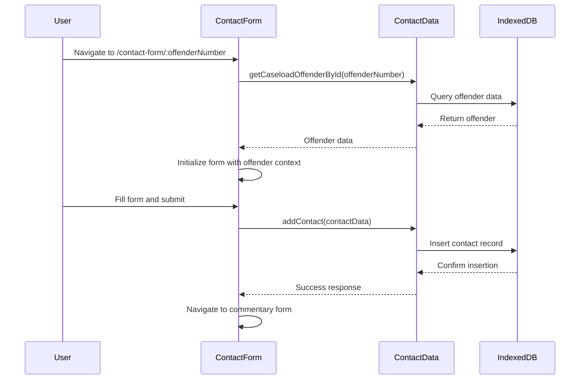
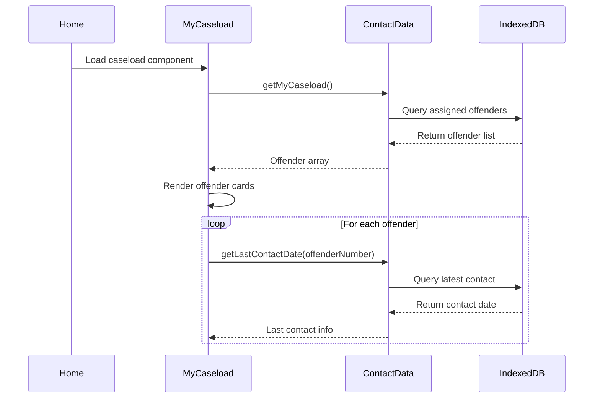
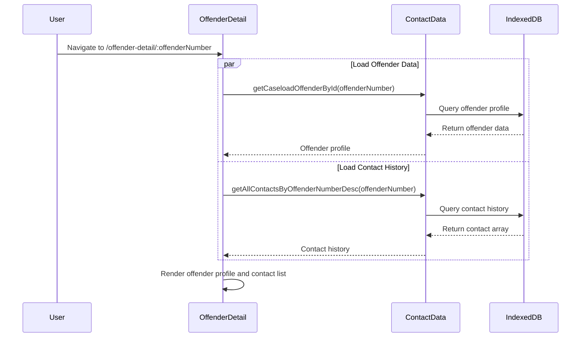

# SupContact - Supervision Contact Management System

[](https://angular.io/)
[](https://www.typescriptlang.org/)
[](https://material.angular.io/)
[](https://web.dev/progressive-web-apps/)

## Overview

SupContact is a Progressive Web Application (PWA) designed for probation and parole supervision management. It enables supervision officers to efficiently track, document, and manage their interactions with offenders under their supervision using an offline-first architecture.

### Key Features

- **Contact Management:** Create, edit, and track supervision contacts with detailed documentation
- **Caseload Management:** View and manage assigned offender caseloads with comprehensive profiles
- **Offline-First Architecture:** Full functionality without internet connectivity using IndexedDB
- **Progressive Web App:** Installable, responsive, and mobile-optimized
- **Material Design UI:** Modern, accessible interface with multiple theme options
- **Multi-Step Forms:** Guided contact creation with validation and auto-save

## Quick Start

### Prerequisites

- Node.js 18+ and npm
- Angular CLI 20.0+

### Installation

```bash
# Clone the repository
git clone <repository-url>
cd ut-udc-apnp-field_contact

# Install dependencies
npm install

# Start development server
ng serve
```

Navigate to `http://localhost:4200/` to access the application.

## Application Architecture

### System Overview

```
┌─────────────────┐    ┌──────────────────┐    ┌─────────────────┐
│   Components    │───▶│     Services     │───▶│   IndexedDB     │
│                 │    │                  │    │                 │
│ • Home          │    │ • ContactData    │    │ • contacts      │
│ • ContactForm   │    │ • Navigation     │    │ • agents        │
│ • OffenderDetail│    │ • Dao            │    │ • myCaseload    │
│ • MyCaseload    │    │ • LocalStorage   │    │ • otherOffenders│
└─────────────────┘    └──────────────────┘    └─────────────────┘
```

### Core Components

#### 1. Home Component (`/`)

**Purpose:** Application dashboard and navigation hub

**Features:**

- Agent profile display with real-time clock
- Caseload overview with quick stats
- Navigation to main application features

**Data Dependencies:**

- Current agent information
- Caseload summary statistics

#### 2. ContactForm Component (`/contact-form/:offenderNumber/:contactId?`)

**Purpose:** Multi-step form for creating and editing supervision contacts

**Features:**

- Reactive form with validation
- Auto-save functionality for incomplete contacts
- Dynamic dropdown population (agents, contact types, locations)
- Date/time picker integration
- Support for primary and secondary interviewers

**Data Flow:**

```
Route Parameters → Load Offender Data → Initialize Form → User Input → Save/Update Contact
```

#### 3. OffenderDetail Component (`/offender-detail/:offenderNumber`)

**Purpose:** Comprehensive offender profile and contact history

**Features:**

- Complete offender profile with contact information
- Chronological contact history display
- Quick contact creation access
- Contact detail navigation

**Data Dependencies:**

- Offender profile data
- Complete contact history
- Contact type and location descriptions

#### 4. MyCaseload Component (Embedded in Home)

**Purpose:** Display and manage assigned offender caseload

**Features:**

- Grid/list view of assigned offenders
- Last contact date tracking
- Quick navigation to offender details
- Search and filter capabilities

### Service Layer

#### ContactData Service

**Primary data management service with comprehensive CRUD operations**

**Key Responsibilities:**

- IndexedDB operations via Dexie.js
- Data validation and transformation
- Business logic enforcement
- Offline data synchronization

**Core Methods:**

```typescript
// Contact Operations
addContact(contact: Contact): Promise<void>
updateContact(contact: Contact): Promise<void>
getContactById(id: number): Promise<Contact>
getAllContactsByOffenderNumberDesc(id: number): Promise<Contact[]>

// Offender Operations
getMyCaseload(): Promise<Offender[]>
getCaseloadOffenderById(id: number): Promise<Offender>
getOtherOffendersOffenderById(id: number): Promise<Offender>

// Reference Data
getInterviewerOptions(): Promise<Select2String[]>
getListOfContactTypes(): Promise<Select2Model[]>
getListOfLocations(): Promise<Select2Model[]>
```

#### Navigation Service

**Centralized routing and navigation management**

**Features:**

- Programmatic navigation between components
- Route parameter management
- Navigation history tracking

#### Dao Service

**Data Access Object providing static data initialization**

**Features:**

- Initial seed data for development
- Data structure definitions
- Offline data population

## Data Models

### Core Entities

```typescript
interface Contact {
  contactId: number;
  offenderNumber: number;
  agentId: string;
  secondaryAgentId: string;
  contactDate: Date;
  contactType: string;
  contactTypeDesc: string;
  location: string;
  locationDesc: string;
  commentary: string;
  formCompleted: boolean;
  firstPageCompleted: boolean;
  wasContactSuccessful: boolean;
}

interface Offender {
  offenderNumber: number;
  firstName: string;
  lastName: string;
  birthDate: Date;
  image: string;
  address: string;
  city: string;
  state: string;
  zip: string;
  phone: string;
  lastSuccessfulContactDate: Date;
  contactArray: Contact[];
}

interface Agent {
  userId: string;
  agentId: string;
  firstName: string;
  lastName: string;
  fullName: string;
  email: string;
  image: string;
  address: string;
  city: string;
  state: string;
  zip: string;
  supervisorId: string;
  ofndrNumList: number[];
}
```

## Detailed Data Flows

### Contact Creation Workflow



### Caseload Loading Workflow



### Offender Detail Loading Workflow



## Component Interactions

### Inter-Component Communication Patterns

1. **Route-Based Navigation**

   ```typescript
   // Navigation with parameters
   this.router.navigate(["/contact-form", offenderNum]);

   // Parameter extraction
   const offenderNumber = Number(this.route.snapshot.params["offenderNumber"]);
   ```

2. **Service-Based Data Sharing**

   ```typescript
   // Shared service injection
   contactData: ContactData = inject(ContactData);

   // Observable-based data streams
   currentAgent = new Observable<Agent>((observer) => {
     this.contactData.getAgentById(this.dao.agent.agentId).then((agent) => observer.next(agent));
   });
   ```

3. **Parent-Child Component Communication**

   ```typescript
   // Parent passes data to child
   <app-offender-card [offender]="offenderData"></app-offender-card>

   // Child emits events to parent
   @Output() contactSelected = new EventEmitter<Contact>();
   ```

## Development

### Development Server

```bash
ng serve
```

Navigate to `http://localhost:4200/`. The application will automatically reload when you change any source files.

### Code Scaffolding

```bash
# Generate a new component
ng generate component component-name

# Generate a new service
ng generate service service-name

# Generate a new interface
ng generate interface model/interface-name
```

### Building

```bash
# Development build
ng build

# Production build
ng build --configuration production
```

Build artifacts are stored in the `dist/` directory.

### Testing

```bash
# Run unit tests
ng test

# Run e2e tests
ng e2e

# Generate code coverage
ng test --code-coverage
```

### PWA Features

```bash
# Add PWA support
ng add @angular/pwa

# Build with service worker
ng build --configuration production
```

## Deployment

### Production Build

```bash
npm run build
```

### PWA Deployment Checklist

- [ ] HTTPS enabled
- [ ] Service worker registered
- [ ] Web app manifest configured
- [ ] Offline functionality tested
- [ ] Install prompt implemented

## Browser Support

- Chrome 80+
- Firefox 75+
- Safari 13+
- Edge 80+

## Contributing

1. Fork the repository
2. Create a feature branch (`git checkout -b feature/amazing-feature`)
3. Commit your changes (`git commit -m 'Add amazing feature'`)
4. Push to the branch (`git push origin feature/amazing-feature`)
5. Open a Pull Request

## License

This project is licensed under the MIT License - see the [LICENSE](LICENSE) file for details.

## Additional Resources

- [Detailed Architecture Documentation](ARCHITECTURE.md)
- [Angular CLI Documentation](https://angular.dev/tools/cli)
- [Angular Material Components](https://material.angular.io/)
- [Dexie.js Documentation](https://dexie.org/)
- [PWA Best Practices](https://web.dev/progressive-web-apps/)
